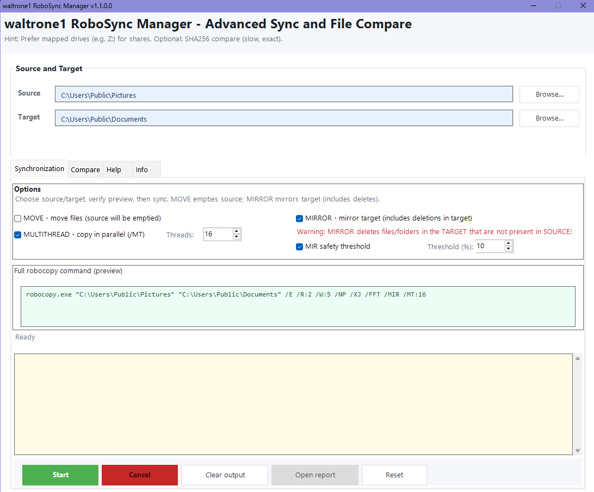
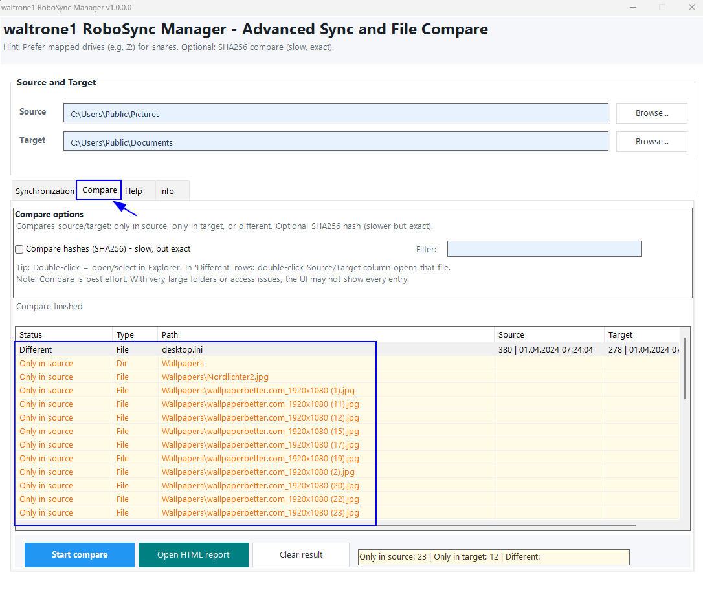
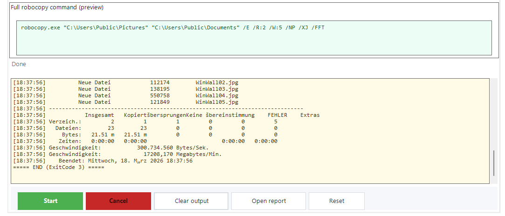
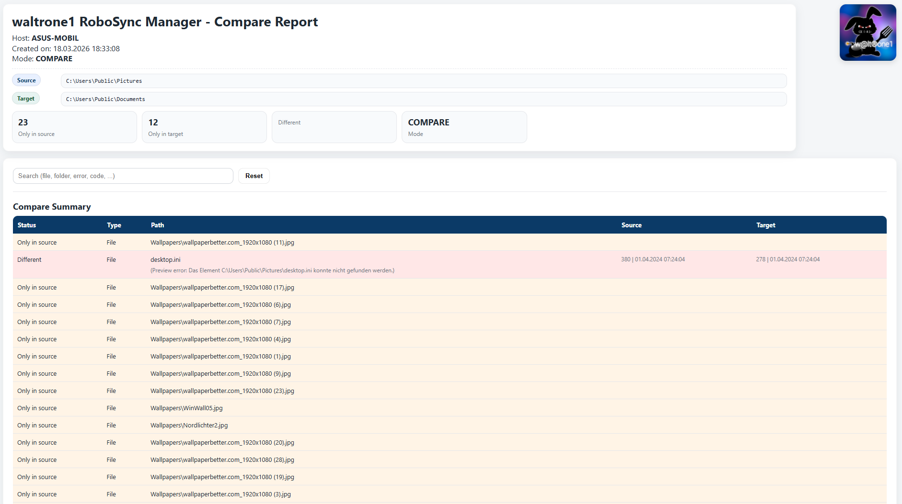
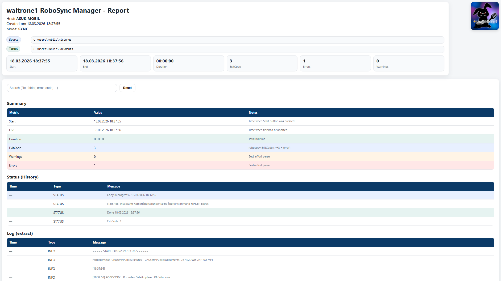

# waltrone1 RoboSync Manager

**waltrone1 RoboSync Manager** is a free Windows file synchronization and directory comparison tool by **WALTRONE**.

It provides a cleaner and more user-friendly interface for common Robocopy workflows, including folder synchronization, directory comparison, command preview, live output and HTML report generation.

The tool is designed for Windows admins, power users and anyone who wants to simplify recurring file synchronization, backup and comparison tasks without manually writing complex Robocopy commands.

---

## Screenshots

The screenshots show the main application window, synchronization mode, compare mode, live Robocopy output and generated HTML reports.

### Main Window



### Compare Mode



### Live Output



### Compare HTML Report



### Sync HTML Report



---

## Features

- Robocopy-based folder synchronization
- Directory comparison mode
- Live Robocopy output
- Command preview before execution
- HTML report generation
- SHA256 compare option
- Mirror mode support
- MIR safety threshold for mirror jobs
- Move mode support
- Multi-threaded copy support via `/MT`
- Configurable `/MT` thread count
- UNC path support
- Task Scheduler support
- Headless task mode for automated runs
- Improved German and English help layout
- Simple Windows-focused workflow
- Portable usage possible
- German / English language support

---

## New in Version 1.1.0.0

Version **1.1.0.0** adds two important Robocopy workflow improvements:

### Multi-threaded copy with `/MT`

The `/MT` option allows Robocopy to copy multiple files in parallel.

This can improve performance, especially when copying many small files. The thread count can be configured in the GUI and is shown in the final command preview before execution.

Example:

```text
/MT:8
/MT:16
```

### MIR safety threshold

The MIR safety threshold is a protection layer for mirror jobs.

Mirror mode can delete files in the destination if they no longer exist in the source. The safety threshold checks the planned changes before the actual mirror operation starts. If too many files would be affected, the user is warned and can stop the operation.

This is intended to help reduce the risk of accidental mass deletions, wrong source selections or unwanted mirror operations after large unexpected changes.

When MIRROR mode is enabled, the MIR safety threshold is automatically enabled by default.

---

## Use Cases

This tool can be useful for:

- Synchronizing folders between local paths
- Synchronizing data to external drives
- Synchronizing folders to network shares
- Comparing source and target directories before or after sync jobs
- Reviewing file differences with optional SHA256 verification
- Creating HTML reports for documentation or handover
- Preparing recurring internal sync jobs
- Running controlled Robocopy workflows with preview and review steps
- Running larger copy jobs with configurable multi-threaded copy
- Using mirror mode with an additional safety check before destructive operations

---

## Project Status

This project is currently available as a public release.

The repository provides source files, documentation, screenshots and release information for transparency and community access.

Current version:

```text
1.1.0.0
```

---

## Download

You can download the latest release from the GitHub Releases section.

A Gumroad download page may also be available for users who prefer a simple download option or want to support the project voluntarily.

---

## Repository Structure

```text
waltrone1-robosync-manager/
│
├── README.md
├── CHANGELOG.md
├── LICENSE
├── .gitignore
│
├── docs/
│   └── usage documentation
│
├── screenshots/
│   ├── main-window.png
│   ├── sync-mode.png
│   ├── compare-mode.png
│   ├── live-output.png
│   ├── compare-report.png
│   ├── sync-report.png
│   └── .gitkeep
│
└── src/
    └── application source files
```

The `src/` folder contains the application source files.

The `screenshots/` folder contains the images used in this README.

Generated files such as `.exe`, `.zip`, `build/`, `dist/` or release folders should not be committed directly to the repository.

---

## Basic Usage

1. Download the latest release.
2. Extract the ZIP file.
3. Start the application.
4. Select source and target folders.
5. Choose synchronization or compare mode.
6. Configure optional settings such as `/MT`, MIRROR, MOVE or SHA256 compare.
7. Review the generated Robocopy command preview.
8. Start the task.
9. Review the live output and generated HTML reports.

---

## Build / Source Notes

The source files are located in:

```text
src/
```

Generated build output such as `.exe`, `.zip`, `build/`, `dist/` or release folders should not be committed directly to the repository.

Final release packages should be published through GitHub Releases.

---

## Safety Notes

Robocopy is powerful and some modes can modify or delete files.

Please review all settings carefully before starting a task.

Important notes:

- Prefer mapped drives for network shares if authentication is required.
- SHA256 comparison is slower but more accurate.
- `/MT` copies multiple files in parallel and can increase load on disks, network shares or NAS systems.
- Mirror mode can delete files in the destination.
- Move mode can remove files from the source after transfer.
- The MIR safety threshold is an additional protection layer, but it does not replace careful review.
- Always review the command preview before execution.
- Always test carefully before productive use.
- Use only in authorized environments.

---

## License

This project is released under the **WALTRONE Community License**.

You may use this tool for free.

However, the following is not allowed without written permission:

- Commercial resale
- Rebranding
- Selling modified versions
- Commercial integration into paid products or services
- Republishing the project under another name
- Removing WALTRONE branding or author information

For details, see the `LICENSE` file.

---

## About WALTRONE

**WALTRONE** is a GitHub and community project focused on small, useful tools for Windows, automation, productivity and system management.

GitHub handle / domain identity:

```text
waltrone1
```

Project brand:

```text
WALTRONE
```

---

## Support

This tool is free to use.

If you find it useful, you may support the project voluntarily through the official WALTRONE download/support page.

---

## Disclaimer

This tool is provided as-is, without warranty of any kind.

Use it at your own risk.

The author is not responsible for data loss, system issues, incorrect synchronization results, deleted files or damages caused by the use of this software.
