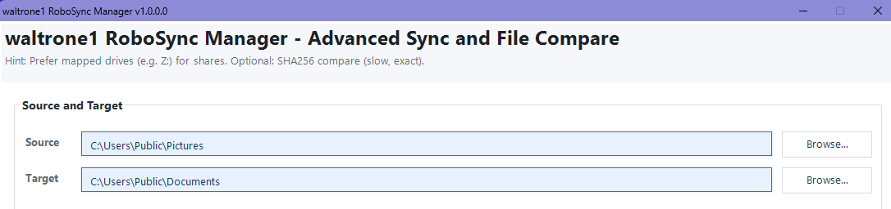

# WALTRONE RoboSync Manager

A simple and practical Robocopy-based sync and backup tool for Windows admins.

> Built to make recurring file copy, backup and sync tasks easier, clearer and more manageable.

---

## Why this tool exists

RoboSync Manager was created because Robocopy is powerful, but not always comfortable to use in daily admin work.

This tool provides a more user-friendly way to create, manage and monitor Robocopy-based jobs.

---

## Features

- Create and manage Robocopy jobs
- Start sync and backup tasks from a simple interface
- View status and logs more easily
- Useful for Windows admins, power users and small IT environments
- Local-first approach

---

## Screenshots

> Screenshots will be added soon.

<!-- Example:

-->

---

## Installation

Download the latest release from the GitHub Releases page.

1. Download the ZIP file
2. Extract it
3. Start the application

---

## Usage

1. Create or select a copy/sync job
2. Configure source and destination
3. Start the job
4. Check the output/logs

---

## License

This project is planned as source-available software.

Free personal use is intended.  
Commercial redistribution, resale or rebranding is not allowed without permission.

Final license text will be added soon.

---

## Support

If this tool helps you, voluntary support is appreciated.

Donation/support links will be added later.

---

## Author

Created by **WALTRONE**  
GitHub: [@waltrone1](https://github.com/waltrone1)
Website: [waltrone1.de](https://waltrone1.de)
